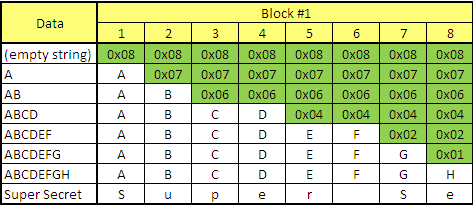

# Portswigger Lab #6: Blind XXE to retrieve data via error messages

En este laboratorio se nos proporciona un exploit server en el cual vamo a poder tener un archivo el cual nosotros vamos a decidir que poner dentro. Lo primero es probar que pasa si cargamos una entidad externa apuntando a nuestro server:

<figure><figcaption></figcaption></figure>

Obtenemos un error. Ahora mirando los logs en nuestro server vemos que se le hizo una request:

<figure><figcaption></figcaption></figure>

Como vemos que si formulamos mal alguna solicitud nos devuelve un error podremos cargar una entidad externa que apunte a nuestro exploit server, en el cual vamos a definir el archivo que vamos a incluir, e incluirlo en otra entidad externa. Como se muestra en la response vamos a ver el contenido del archivo.

**Exploit server:**

<figure><figcaption></figcaption></figure>

La primera entidad que estamos cargando es la que se nos pide para resolver el lab, que es el archivo /etc/passwd.

La segunda línea es una entidad dentro de otra entidad, en la que en la entidad **eval** se carga la segundad entidad **exfil**, que es una entidad externa y se apunta a un archivo dentro de la máquina que no existe (por lo tanto este error se va a mostrar en la response ya que el servidor nos muestra errores), y como queremos motrar el archivo /etc/password se lo concatenamos. Entonces resumiendo como este archivo no existe y generará un error, y ya que el server nos muestra los errores en la response de lo que hayamos puesto mal en el documento XML nos mostrará el contenido del archivo.

**Request && Response:**

<figure><figcaption></figcaption></figure>

## Aclaraciones

Al usar una entidad paramétrica dentro de otra entidad (paramétrica también) si anteponemos el % en la entidad **exfil**, eso no funcionará debido hay que especificarlo en hexadecimal, por eso se pone el \&#x25, el 25 en hexadecimal representa el %. Por lo que anteponiendo el \&#x representamos valores hexadecimales.

También cuando llamamos a una entidad dentro del DTD anteponemos % y no  &, como en el primer laboratorio.
